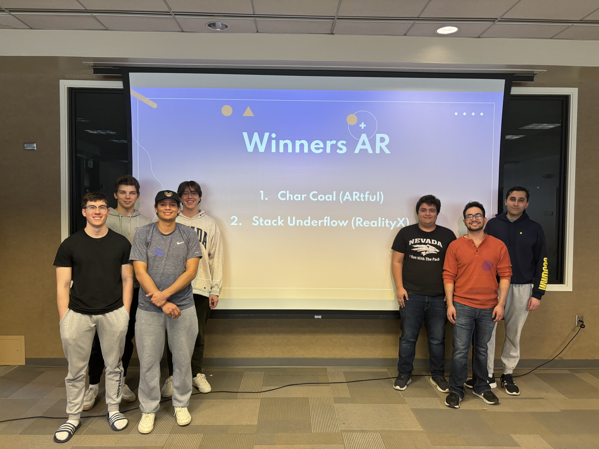
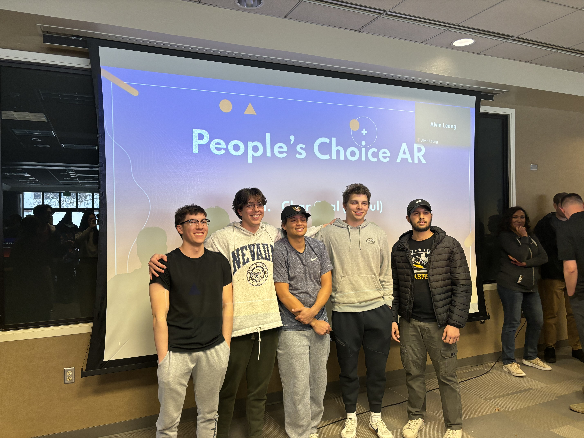

# ARtful

A charades app that implements augmented reality to bring the classic party game to life.

## 🏆 Achievements

**ARtful** developed by team Char Coal was recognized at [The Biggest Little Hackathon, 2024]:

* **1st Place**: Augmented Reality Category
* **2nd Place**: Overall Hackathon Winner
* **People's Choice Award**: AR Category

## 👥 Team Char Coal
* **Oliver Zolan**
* **Zac Waiksnoris** — [GitHub](https://github.com/zwaiksnoris)
* **Bennet Rau** — [GitHub](https://github.com/bennetrau)
* **Sutter Reynolds** — [GitHub](https://github.com/Sutter-Reynolds)

## 📸 Highlights

*Team Char Coal taking 1st place in the AR category and 2nd place overall.*

*Accepting the People's Choice Award for ARtful w/ Saransh 😎.*
